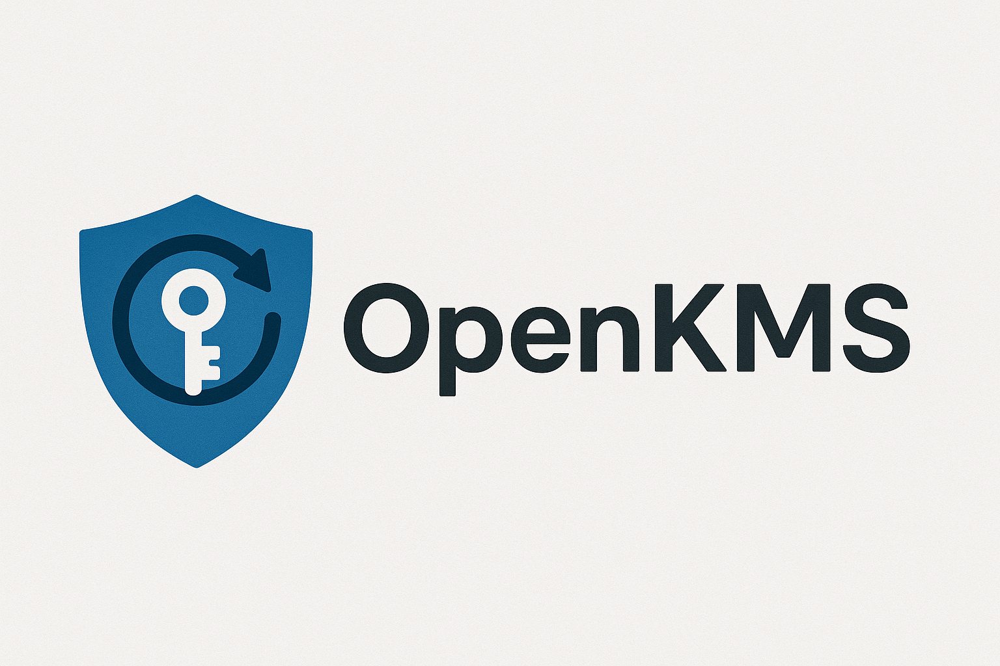

# OpenKMS

OpenKMS is a skeleton implementation of a Key Management Service (KMS) written in Go. It provides a foundation for building production-ready key management systems with essential security features and extensible architecture.



## Overview

OpenKMS is designed as a modular, secure, and scalable key management service that handles cryptographic key lifecycle, encryption/decryption operations, digital signatures, and HMAC computation. The project serves as a starting point for organizations that need a custom KMS solution tailored to their specific requirements.

## Features

### Core Functionality

- **Key Management**: Create, retrieve, list, and delete cryptographic keys
- **Cryptographic Operations**: Encryption, decryption, digital signing, signature verification, and HMAC computation
- **Key Lifecycle**: Full key lifecycle management with versioning and rotation support
- **Key Rewrap**: Re-encrypt ciphertext with new key versions without exposing plaintext

### Security

- **Multiple Storage Backends**: Support for BoltDB, PostgreSQL, etcd, and file-based storage
- **Envelope Encryption**: All keys are encrypted at rest using envelope encryption
- **Master Key Providers**: Multiple options for master key management:
  - Environment variable (development only)
  - Password-encrypted file
  - PKCS#11 HSM integration
  - TPM 2.0 hardware security module
- **Multiple Authentication Methods**: Static tokens, mTLS, and OIDC/JWT authentication
- **Advanced Authorization**: 
  - Role-based access control (RBAC) using Casbin
  - Attribute-based access control (ABAC) with flexible policy evaluation
  - Multi-tenant support with namespace isolation
  - Policy inheritance and tenant-scoped policies
- **Audit Logging**: Comprehensive audit logging with cryptographic signing
- **Audit Retention**: Configurable retention policies for audit logs

### High Availability

- **Leader Election**: Automatic leader election using PostgreSQL advisory locks or etcd leases
- **Read Replicas**: Support for read-only replicas to distribute read load
- **Sticky Sessions**: Client session affinity for consistent routing
- **Health Checks**: Comprehensive health check endpoints for service monitoring
- **Multi-Node Support**: Deploy multiple instances with shared storage coordination

### Operations

- **CLI Tool**: Command-line interface for key management and operations
- **REST API**: HTTP/HTTPS API for programmatic access
- **Metrics**: Prometheus metrics for monitoring and observability
- **Health Checks**: Health check endpoints for service monitoring

## Project Status

This is a skeleton implementation. The project provides a solid foundation with core functionality implemented, including high availability features, multiple storage backends, HSM/TPM support, and advanced authorization. However, it is not production-ready and requires additional work for specific use cases. Key areas that may need enhancement include:

- Advanced key rotation policies
- Backup and disaster recovery procedures
- Performance optimization and load testing
- Additional security hardening and compliance certifications
- Comprehensive documentation and deployment guides

## Getting Started

### Prerequisites

- Go 1.25 or later
- Make (for build automation)

### Building

```bash
make build
```

This will build both the server (`openkms-server`) and CLI (`openkms-cli`) binaries in the `bin/` directory.

For more build options, see the `Makefile` or run `make help`.

### Running the Server

```bash
./bin/openkms-server
```

The server will start on `localhost:8080` by default. Configuration can be provided via environment variables. See `internal/config/config.go` for available configuration options.

### Using the CLI

```bash
./bin/openkms-cli --help
```

The CLI provides commands for key management, cryptographic operations, and service administration.

### Testing

```bash
make test
```

Run tests with coverage:

```bash
make test-coverage
```

This will generate a coverage report to help ensure code quality and test completeness.

## Project Structure

```
openkms/
  cmd/
    openkms-server/    # Server application
    openkms-cli/       # CLI tool
  internal/
    audit/             # Audit logging and signing
    authn/             # Authentication
    authz/             # Authorization (RBAC, ABAC, Casbin)
    config/            # Configuration management
    cryptoengine/      # Cryptographic operations
    ha/                # High availability (leader election, read replicas)
    keystore/          # Key storage and management
    logging/           # Structured logging
    metrics/           # Prometheus metrics
    policies/          # Security policies (master key providers)
    server/            # HTTP server and handlers
    storage/           # Storage backends (BoltDB, PostgreSQL, etcd)
  pkg/
    sdk/               # Client SDK
```

## License

Licensed under the Apache License, Version 2.0. See [LICENSE](#LICENSE) file for details.

## Contributing

This is a skeleton project. Contributions, improvements, and feedback are welcome. 

## Repository

https://github.com/Gosayram/openkms

